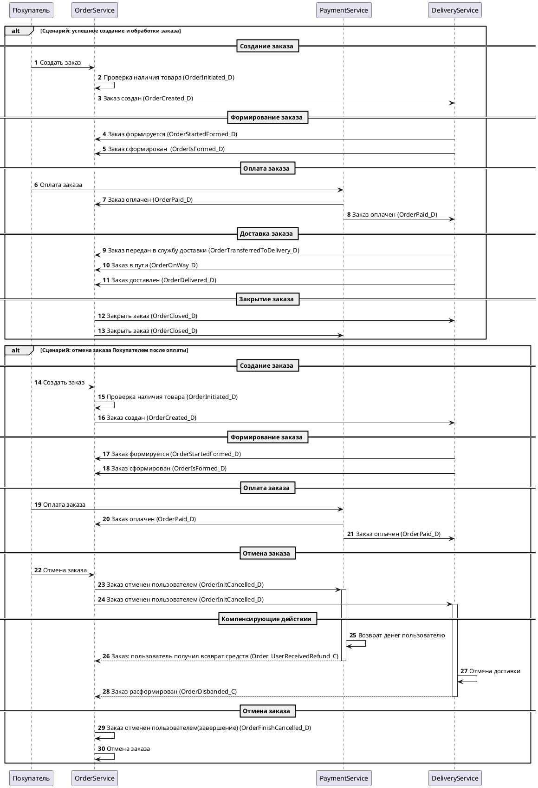

# ADR-002: Часть 2. Проектирование Saga для оформления заказа
## Автор: Сурков Александр
## Дата: 28.08.2025
## 1. Контекст
Необходимо подробнее проработать реализацию сценария оформления заказа. В рамках этого сценария на разных этапах могут случиться ошибки вроде неоплаты заказа. Эти ошибки требуют компенсационных действий, поэтому здесь нужно спроектировать и реализовать Saga-хореографию.
Составьте реестр событий для вашей Saga-хореографии оформления заказа. Для каждого события опишите логический этап, тип этого события и наименование.

События могут быть одного из четырёх типов:
- Domain Events (доменные события)
- Failure Events (события ошибок)
- Compensation Events (компенсационные события)
- Timeout/Control Events (события таймаутов)

## 3. Решение
### 3.1 Таблица событий при оформлении заказа

| Этап                                                          | Тип события  | Название                     |
|---------------------------------------------------------------|--------------|------------------------------|
| Заказ инициирован(ожидает проверки наличия товаров)           | Domain       | OrderInitiated_D             |
| Заказ создан                                                  | Domain       | OrderCreated_D               |
| Заказ не создан                                               | Failure      | OrderNotCreated_F            |
| Заказ формируется                                             | Domain       | OrderStartedFormed_D         |
| Заказ не может быть сформирован(товар отсутствует у продавца) | Failure      | OrderCouldNotFormed_F        |
| Заказ сформирован                                             | Domain       | OrderIsFormed_D              |
| Заказ оплачен                                                 | Domain       | OrderPaid_D                  |
| Заказ не оплачен(ошибка при оплате)                           | Failure      | OrderErrorDuringPayment_F    |
| Заказ не оплачен(время ожидания оплаты истекло)               | Timeout      | OrderPaymentTimeExpired_T    |
| Заказ передан в службу доставки                               | Domain       | OrderTransferredToDelivery_D |
| Заказ в пути                                                  | Domain       | OrderOnWay_D                 |
| Заказ доставлен                                               | Domain       | OrderDelivered_D             |
| Заказ закрыт                                                  | Domain       | OrderClosed_D                |
| Заказ отменен пользователем(инициализация)                    | Domain       | OrderInitCancelled_D         |
| Заказ отменен пользователем(завершение)                       | Domain       | OrderFinishCancelled_D       |
| Заказ: пользователь получил возврат средств                   | Compensation | Order_UserReceivedRefund_C   |
| Заказ расформирован                                           | Compensation | OrderDisbanded_C             |

## 4. Альтернативы

## 5. Недостатки, ограничения, риски
